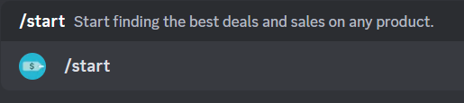
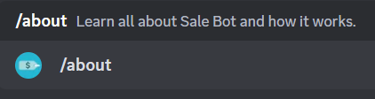
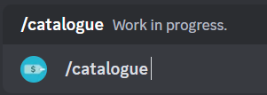
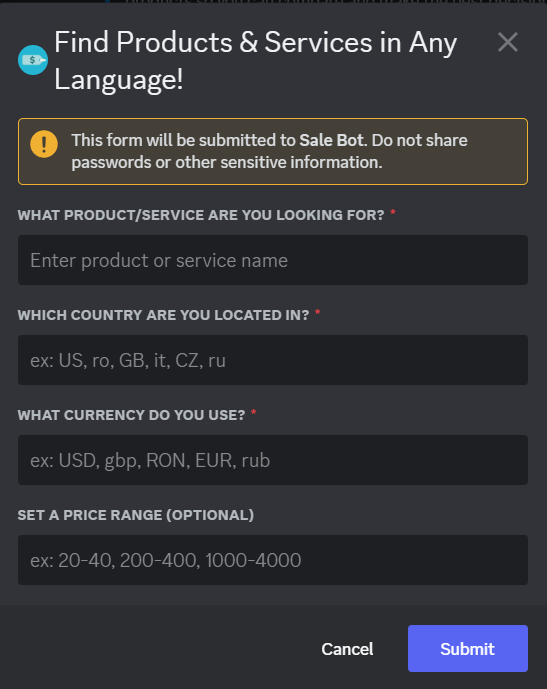
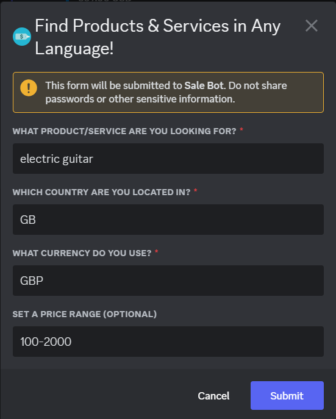
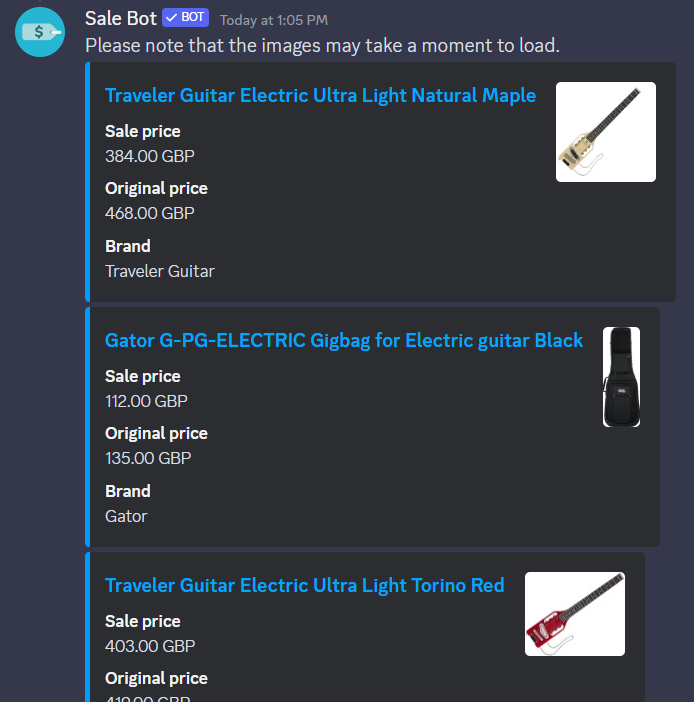
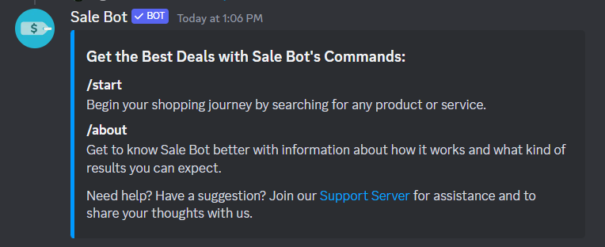
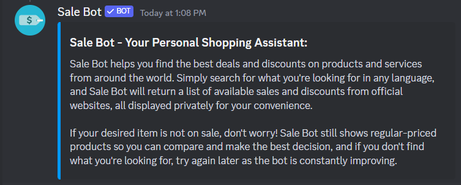
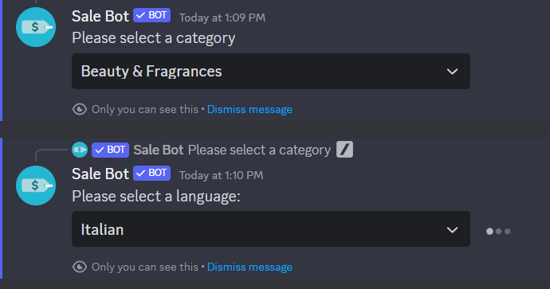

# Discord-Sale-Bot

**Description**

A Discord Bot that retrieves products that are on sale.

The products are retrieved from CJ Affiliate using their API and Node.js for hosting

**How to add the bot**

Access this  in order to add the bot to your server using the "Invite" button on the website.

**How it works and quick start**

Commands:

The /start command prompts the user to input some information in order to retrieve the specific product they are looking for.

The /help command gives the user some usage information

The /about command explains how the bot works

The /catalogue command gives specific products based on the selected product category and language

